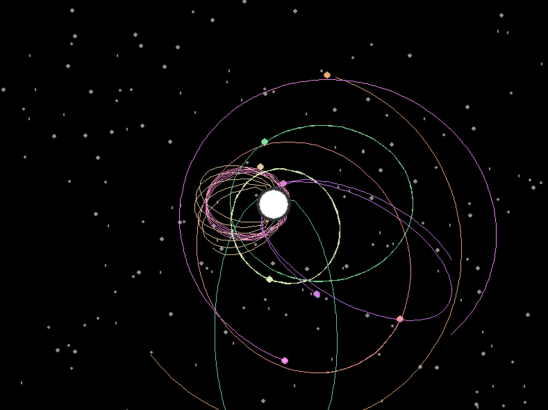

#  Orbit
A simulation written in python using the pygame library.

There is a relitively simple formula for determining gravitational forces between two bodies in a vacuum. 

The velocity of a body with mass can be affected by another body with mass with the following formula:

1. `[force] = [gravitational constant] x [self mass] * [other body mass] / [distance]^2`
2. `[theta] = arctangent([distance x], [distance y])`
3. `[change in x velocity] = cosine([theta]) * [force]`
4. `[change in y velocity] = sine([theta]) * [force]`

# Usage and Requirements
You will need a Python 3 environment with pygame installed.
1. `pip install pygame`
2. `python3 orbit.py`

# Screenshots
